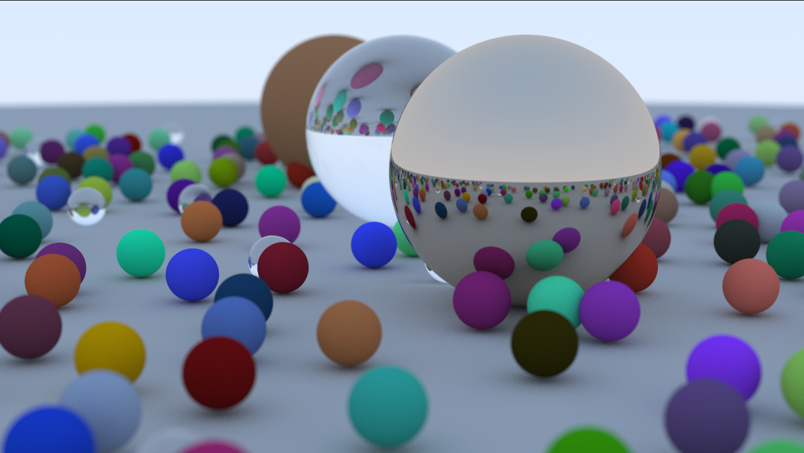
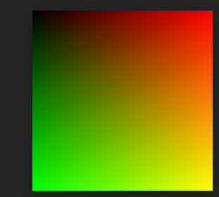
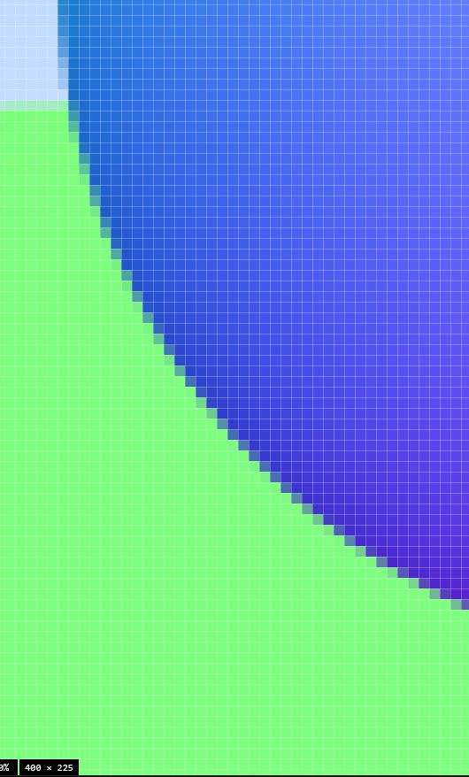
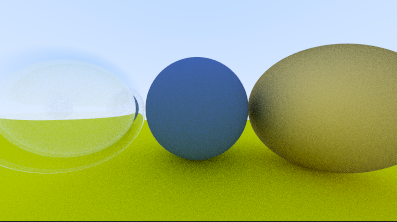
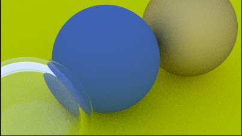
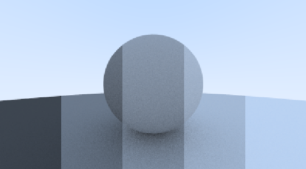

# Ray Tracer in One Weekend
A C++ ray tracer implementation following Peter Shirley, Trevor David Black, and Steve Hollasch's book [*Ray Tracing in One Weekend*](https://raytracing.github.io/books/RayTracingInOneWeekend.html).

*Final render - 1200x800, 500 samples per pixel, ~3 hours render time*

## What I Learned
Throughout this project, I implemented various graphics and ray tracing concepts:
- **PPM Image Format** - Understanding raw image data representation
- **Ray-Sphere Intersection** - Core geometric calculations for ray tracing
- **Surface Normals** - Computing surface orientation for lighting
- **Anti-Aliasing** - Multiple samples per pixel for smooth edges
- **Material Systems**:
  - Diffuse (Lambertian) materials
  - Metallic materials with controllable roughness
  - Dielectrics (glass) with refraction and total internal reflection
- **Positionable Camera** - Arbitrary viewpoints and orientations
- **Defocus Blur** - Depth of field effects for realistic focus

This project also strengthened my C++ skills through advanced OOP practices, operator overloading, and working with virtual functions and inheritance.

## Features
- Physically-based rendering with recursive ray bouncing
- Three material types with realistic light interaction
- Configurable camera with field of view and focus distance
- Depth of field simulation
- Multi-sample anti-aliasing

## Technical Details
**Language:** C++  
**Compilation:** `g++ main.c++ -o raytracer`  
**Usage:** `./raytracer > output.ppm`

## Future Plans
- **GPU Acceleration** - Port to CUDA/OptiX for real-time rendering (current render: ~3 hours)
- **Ray Tracing: The Next Week** - Implementing BVH acceleration, textures, and volumes
- **Ray Tracing: The Rest of Your Life** - Advanced techniques like importance sampling and Monte Carlo integration

## Sample Renders
Progression of features implemented throughout the book:

| Gradient & Ray Setup | Sphere & Normals | Aliasing(Bottom) & Anti-Aliasing(Top) |
|:---:|:---:|:---:|
|  |  |   |

| **Diffuse Materials** | **Reflection & Refraction** | **Positionable Camera** |
|  |  |    |

| **Defocus Blur** | **Gamut Correction** | **Final Render** |
|  |  |  |

---
Built as a learning project to develop a better understanding of the computer graphics fundamentals and physically-based rendering.
